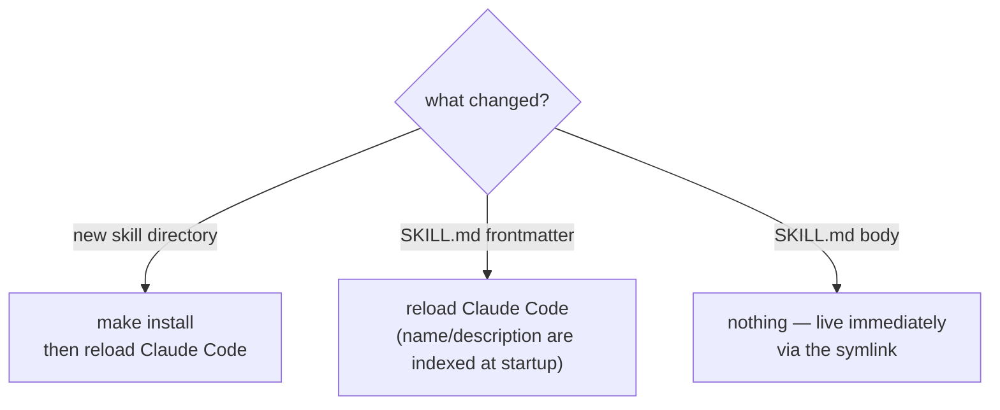

# Contributing

## Prerequisites

- `git` and `make` — the repo has no language runtime, no dependencies and no package manifest. `make install` is POSIX `sh` and GNU `make`.
- [Claude Code](https://claude.com/claude-code), to run the skills you're editing.

## Set up

Clone the repo and run `make install` once — the same procedure as [installing to use the skills](docs/usage/install.md). Working on them needs nothing further: the installer symlinks rather than copies, so the checkout you edit is the one Claude Code reads.

## Tests and linting

There are none. The Makefile has a single `install` target, there is no CI, and the repo's content is Markdown. Verification is running the skill you changed against a real project and reading its output.

## Project layout

`skills/<name>/SKILL.md` is the whole payload; `docs/` documents it. Every directory directly under `skills/` is a skill, and nothing else in the repo is — see [Architecture](docs/internals/architecture.md) for why the boundary is positional, and [Repo layout](docs/reference/repo-layout.md) for what sits where.

## Making a change

**Adding a skill:**

1. Create `skills/<skill-name>/SKILL.md` with the frontmatter described in [`SKILL.md` format](docs/reference/skill-format.md).
2. Run `make install` to symlink it into `~/.claude/skills/`.
3. Restart or reload Claude Code so it picks up the new skill.

**Changing a skill:** edit the files under `skills/<skill-name>/` directly.

Work on a branch off `main` and open a pull request; commit subjects in this repo are short and lowercase, describing the change rather than the files.

<!-- TODO: verify — no PR template, review requirement or merge convention is recorded anywhere in the repo, so nothing beyond the branch-and-PR flow is asserted here. -->

## Design decisions

A change that alters the skills' convention, or how skills reach Claude Code, gets an ADR — see [the log and its template](docs/internals/adrs/README.md). Routine wording and rule refinements don't.

## Documentation

The docs describe the skills, so a change to a skill usually changes them. Run `/docs-update` after the change, or `/docs-init` if you've reshaped the convention itself. Start from [the docs router](docs/README.md).
