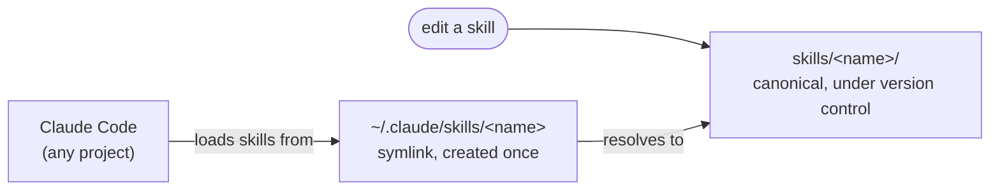

# Explanation

## Purpose

`docschemy` is a single source of truth for personal [Claude Code](https://claude.com/claude-code) skills, shared across many unrelated projects. Rather than copy-pasting a skill into every repo that needs it, each skill lives here once and is symlinked into `~/.claude/skills/`.

The name and structure grew out of a broader documentation problem: keeping consistent, discoverable docs across dozens of personal projects (scripts, services, R&D, scrapers, mobile apps) regardless of language or context. The skills here are the concrete piece of that — they apply the [Diátaxis](https://diataxis.fr/) framework (Tutorials, How-To Guides, Reference, Explanation) to any project's `docs/` directory, in-repo, in Markdown.

## Why symlinks instead of copying

Editing a skill should immediately affect every project using it, without a reinstall step. `make install` therefore symlinks rather than copies:

The canonical version stays in this repo's history; Claude Code reads it from the standard skills location and never knows the difference. A copy-based install would put the two out of sync the moment a skill was edited in either place — and the stale copy is the one Claude would actually read.

The cost of the symlink approach is that `~/.claude/skills/` now depends on this repo staying checked out at a fixed path. `make install` accepts that and hardens the other direction instead: it refuses to overwrite anything it didn't create, so a manually installed or third-party skill of the same name is reported rather than silently replaced. Losing a skill you can `git checkout` is cheap; losing one you can't is not.

## Why two documentation skills instead of one

`docs-init` and `docs-update` do overlapping work under the same convention, and the split is deliberate: the two situations have opposite cost profiles.

A full survey — read the whole repo, audit every page for naming, visuals, and duplication — is what catches drift, but it's far too expensive to run after every commit, and running it on a small change invites gratuitous restructuring of pages that change never touched. An incremental update is cheap enough to run constantly, but it is structurally blind: seeing one page at a time is exactly how a second copy of a fact gets created, and it can't notice that a page it never opened went stale.

So each skill is given the failure mode it can actually handle, and told to defer on the other. `docs-update` reports what it can't vouch for rather than guessing; `docs-init`'s reconcile mode is what sweeps the whole tree. Merging them would mean one skill that either over-runs on small changes or under-audits on large ones.

## Why diagrams are a default, not a decoration

Structure, sequence, and state are read far faster from a picture than from a paragraph, so both skills treat a visual as the default whenever the subject has a shape — in any quadrant, not just this one. Mermaid is the preferred form: it renders directly on GitHub, reviews as a text diff, and can't drift out of sync unnoticed the way a checked-in screenshot does. Binary images are reserved for what code can't draw (real UI, dashboards, hardware) and live in a single `docs/assets/` directory so their paths survive a page moving between quadrants.

The tradeoff accepted here: a wrong diagram is more damaging than a wrong sentence, because readers trust the picture over the prose around it. Both skills therefore bind diagrams to the same no-invention rule as text, and make node-by-node diagram review an explicit step when something gets removed.
