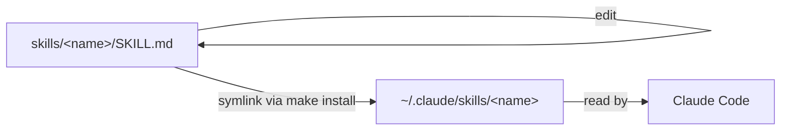

# Explanation

## Purpose

`docschemy` is a single source of truth for personal [Claude Code](https://claude.com/claude-code) skills, shared across many unrelated projects. Rather than copy-pasting a skill into every repo that needs it, each skill lives here once and is symlinked into `~/.claude/skills/`.

The name and structure grew out of a broader documentation problem: keeping consistent, discoverable docs across dozens of personal projects (scripts, services, R&D, scrapers, mobile apps) regardless of language or context. The `docs-init` skill is the first concrete piece of that: it applies the [Diátaxis](https://diataxis.fr/) framework (Tutorials, How-To Guides, Reference, Explanation) to any project's `docs/` directory, in-repo, in Markdown, with Mermaid for diagrams.

## Why symlinks instead of copying

Editing a skill should immediately affect every project using it, without a reinstall step. `make install` therefore symlinks rather than copies:

This keeps the skill's canonical version under version control in this repo, while Claude Code reads it from the standard skills location.

## Idempotency and safety

`make install` never overwrites a pre-existing, non-symlinked path under `~/.claude/skills/` — it skips that skill and reports why, so a manually-installed or third-party skill of the same name isn't silently clobbered.
