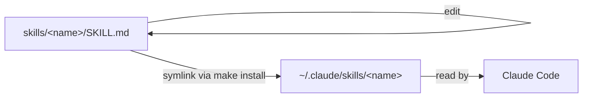

# Explanation

## Purpose

`docschemy` is a single source of truth for personal [Claude Code](https://claude.com/claude-code) skills, shared across many unrelated projects. Rather than copy-pasting a skill into every repo that needs it, each skill lives here once and is symlinked into `~/.claude/skills/`.

The name and structure grew out of a broader documentation problem: keeping consistent, discoverable docs across dozens of personal projects (scripts, services, R&D, scrapers, mobile apps) regardless of language or context. The `docs-init` skill is the first concrete piece of that: it applies the [Diátaxis](https://diataxis.fr/) framework (Tutorials, How-To Guides, Reference, Explanation) to any project's `docs/` directory, in-repo, in Markdown.

## Why diagrams are a default, not a decoration

Structure, sequence, and state are read far faster from a picture than from a paragraph, so both skills treat a visual as the default whenever the subject has a shape — in any quadrant, not just this one. Mermaid is the preferred form: it renders directly on GitHub, reviews as a text diff, and can't drift out of sync unnoticed the way a checked-in screenshot does. Binary images are reserved for what code can't draw (real UI, dashboards, hardware) and live in a single `docs/assets/` directory so their paths survive a page moving between quadrants.

The tradeoff accepted here: a wrong diagram is more damaging than a wrong sentence, because readers trust the picture over the prose around it. Both skills therefore bind diagrams to the same no-invention rule as text, and make node-by-node diagram review an explicit step when something gets removed.

## Why symlinks instead of copying

Editing a skill should immediately affect every project using it, without a reinstall step. `make install` therefore symlinks rather than copies:

This keeps the skill's canonical version under version control in this repo, while Claude Code reads it from the standard skills location.

## Idempotency and safety

`make install` never overwrites a pre-existing, non-symlinked path under `~/.claude/skills/` — it skips that skill and reports why, so a manually-installed or third-party skill of the same name isn't silently clobbered.
