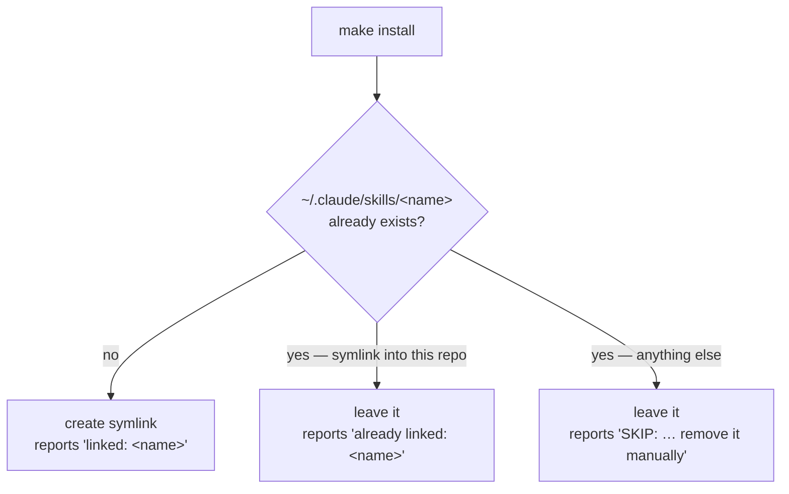
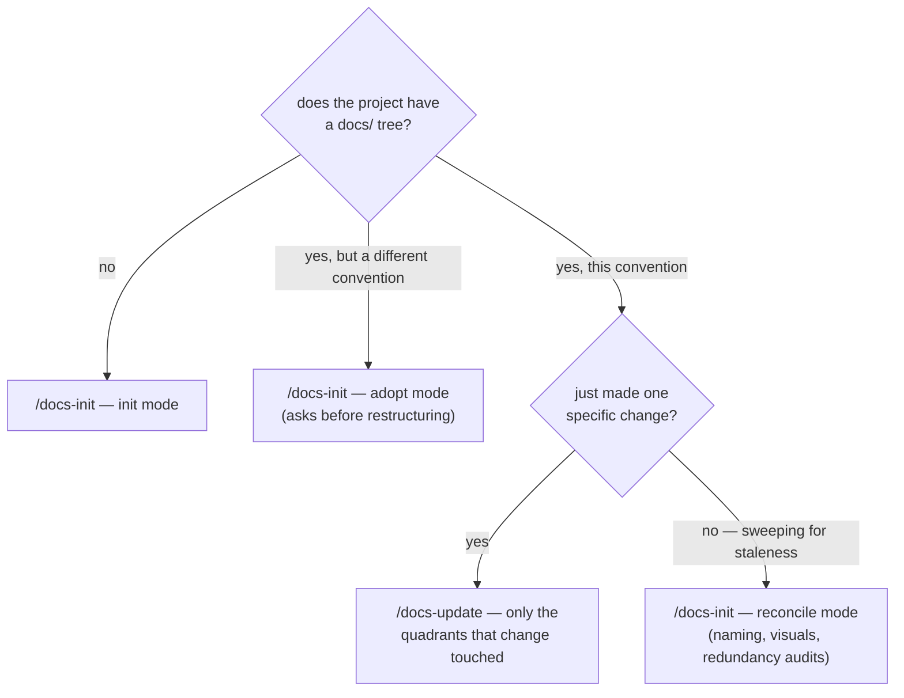

# How-To Guides

## Install all skills

```sh
make install
```

This symlinks every directory under `skills/` into `~/.claude/skills/`, so later edits in this repo take effect without reinstalling.

Each skill gets one of three outcomes, decided per skill:



A `SKIP` means something else already owns that name — a manually installed or third-party skill. `make install` will never overwrite it; delete or rename the conflicting path yourself, then re-run.

## Add a new skill

1. Create `skills/<skill-name>/SKILL.md` with the frontmatter described in [`SKILL.md` format](reference/skill-format.md).
2. Run `make install` to symlink it into `~/.claude/skills/`.
3. Restart or reload Claude Code so it picks up the new skill.

## Change an existing skill

Edit the files under `skills/<skill-name>/` directly. No reinstall — `make install` created a symlink, so Claude Code reads the working copy. A reload is only needed if you changed the frontmatter, since that's what Claude Code indexes.

## Use the skills on another project

The skills are global once installed, so nothing needs to be added to the target repo. From a Claude Code session in that project, invoke the one you want by name:

```text
/docs-init
/docs-update
```

Both work on the project you're currently in, not on this repo.

## Choose between `docs-init` and `docs-update`



`/docs-update` never opens a page the change didn't touch, so it can't find drift elsewhere — it reports what looks stale and leaves it. Retrofitting a project to a newer version of the convention is always a `/docs-init` reconcile. See [Skill catalog](reference/skill-catalog.md) for what each mode does.
