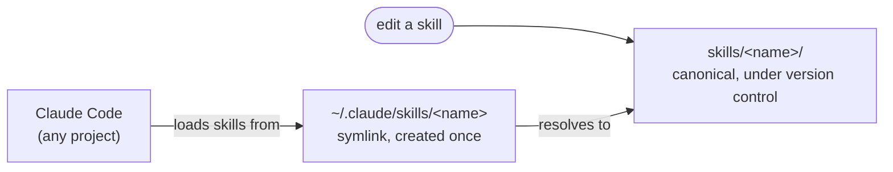

# Architecture

`docschemy` has no application source. The repo *is* a set of skill definitions plus the one-line installer that publishes them, so this page is entirely about where a skill file lives and how Claude Code comes to read it.

The repo also ships a local telemetry stack under `telemetry/`, which shares nothing with the skills beyond the Makefile — it has its own page, [The telemetry pipeline](telemetry-pipeline.md).

## Skills are linked, not copied

There is exactly one copy of every skill, in this repo, under version control. `make install` creates the symlink once; every later edit is live in every project immediately, with no reinstall step. Claude Code reads the skill from its standard location and never knows the difference.

Two consequences fall out of this:

- **`~/.claude/skills/` depends on this checkout staying put.** The symlinks are absolute, resolved from `$(CURDIR)` at install time. Moving the clone breaks them until `make install` runs again.
- **Only frontmatter changes need a reload.** The body is read when the skill runs, so editing it takes effect immediately; `name` and `description` are indexed at startup.

See [ADR 0001](adrs/0001-symlink-skills-instead-of-copying.md) for what this was chosen over.

## `make install` never destroys

The installer's one safety property: it only ever creates a symlink at a path that is empty, or already points into this repo. Anything else at that path — a hand-installed skill, one from a third party — is reported and left alone. A skill lost from this repo is a `git checkout` away; one installed by hand is not, so the installer refuses to be the thing that removes it.

The per-skill decision and its three outcomes are in [Install the skills](../usage/install.md).

## What counts as a skill

Every directory directly under `skills/` is a skill, and nothing else in the repo is. There is no manifest, no registry, and no list to keep in sync — the directory listing *is* the list, and adding a directory is the whole of adding a skill. `SKILL.md` is the only file a skill must contain, though the entire directory is linked, so supporting files sit beside it at the same path.

The tradeoff is that the boundary is positional rather than declared: a stray directory under `skills/` becomes a skill on the next `make install`. For a repo whose payload is a handful of hand-written directories, that's cheaper than maintaining a manifest that can disagree with the filesystem.
