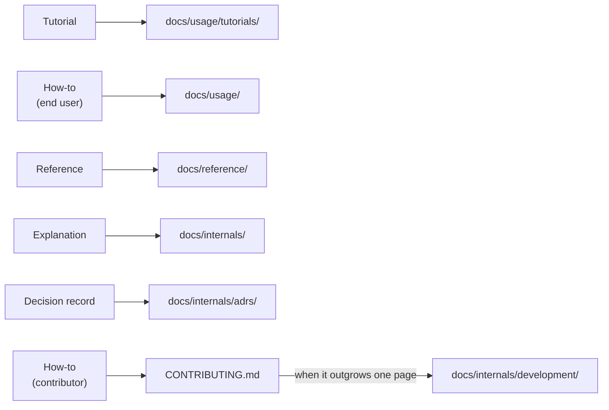

# The documentation convention

All four skills encode one convention. This page explains the shape it has and why; the skill files themselves are the normative statement of the rules, and [Skill catalog](../reference/skill-catalog.md) lists what each skill does.

## Two axes, not one

[Diátaxis](https://diataxis.fr/) sorts documentation by what a page *is* — tutorial, how-to, reference, explanation. That is a good rule for writing a page and a poor rule for laying out a repo: it says nothing about who a page is for, and it has no home at all for the person who wants to work on the project rather than use it.

So the convention uses Diátaxis for pages and a fixed structural layer for paths. Audience picks the directory; mode picks the page:

The contributor row is the gap being closed: "how do I set this up and submit a change" is a how-to, but pointing an end user at it is noise, and burying it in an explanation section loses it. It gets a governed file at the repo root, where people already look.

`docs/usage/` is held to a black-box rule as the counterweight — a page needing a source checkout or knowledge of internal components isn't a usage page. Without that line the audience split collapses back into a single undifferentiated pile.

## The layout is identical everywhere

Every project gets `README.md`, `CONTRIBUTING.md`, and `docs/` holding `README.md`, `usage/`, `reference/`, `internals/` (with `adrs/`), and `assets/` — created in full, even when a section is thin. An earlier version created only the quadrants that "earned their keep" and let each start as a flat file, promoted to a directory on growth. That produced correct docs with a different layout in every repo, which is precisely what a person moving between a dozen projects — or a future cross-project portal — cannot rely on.

The cost is real: a thin section still gets a landing page, and small repos carry more directories than their content strictly needs. The judgment is that predictable paths are worth more than minimal ones, since the alternative makes every project a fresh navigation problem. See [ADR 0004](adrs/0004-wrap-diataxis-in-a-fixed-structure.md).

## Why the work is split across four skills

Every skill here applies the same convention. What separates them is **what triggered the run**, because the trigger is also what the run is allowed to treat as authoritative:

| | Triggered by | Authority | Writes |
|---|---|---|---|
| `docs-init` | An undocumented or unswept tree | the repo | yes |
| `docs-update` | A code change | the diff | yes |
| `docs-edit` | A person wanting the docs different | the user for style, the repo for facts | yes |
| `docs-search` | A person wanting to know something | the docs | no |

The first split, between `docs-init` and `docs-update`, was about cost:

| | `docs-init` | `docs-update` |
|---|---|---|
| Reads | the whole repo | one change |
| Catches | drift anywhere, via naming / visuals / redundancy audits | exactly what the change touched |
| Costs | too much to run per commit | cheap enough to run constantly |
| Blind to | nothing, by design | anything it didn't open |

A full survey is what catches drift, but running it after a small change invites gratuitous restructuring of pages that change never touched. An incremental run is structurally blind in the opposite way: seeing one page at a time is exactly how a second copy of a fact gets created, and it can't notice that a page it never opened went stale.

Each skill is therefore given the failure mode it can handle and told to defer on the other — `docs-update` *reports* what it can't vouch for instead of guessing, and says so in its summary. Merging them would produce one skill that either over-runs on small changes or under-audits on large ones. See [ADR 0002](adrs/0002-split-init-and-update-into-two-skills.md).

The later two split on the authority question rather than the cost one. `docs-search` writes nothing at all, which is the only property that makes it safe to invoke mid-task and is worth more than any capability it gives up — and being read-only, it needn't insist on the convention, so it works on layouts the other three refuse. `docs-edit` is the only skill that takes instruction from a person, so it's the only one where a request can assert something the code contradicts; separating it keeps that verification rule out of the three skills that never need it, and keeps `docs-update`'s diff-driven spine — scope from the change, delete what the change removed — out of a run where no code moved. See [ADR 0005](adrs/0005-split-docs-skills-by-trigger.md).

## Preferences are recorded, not remembered

A convention identical in every project meets a user who has taste about their own. The two only coexist if a deliberate deviation can be told apart from drift — and from inside a repo they look the same, so an unrecorded preference survives exactly until the next incremental run "corrects" it back to the default. Applying a preference is therefore not the hard part; making it stick is.

The mechanism is a `## Docs preferences` block in the project's `CLAUDE.md`, written by `docs-edit` and read by all four skills. Claude Code already loads that file every session, so it costs nothing to build: no new file format, no loader, no install step, and the user can read and edit the block themselves. Scope comes free too — `~/.claude/CLAUDE.md` for preferences that span projects.

Preferences override *style* without argument. They may override *structure* as well, but only as an override recorded with its reason, which is what stops a later run from treating it as a mistake. What they can't override is verification: a preference that suppressed checking claims against the code would let the docs assert things the repo doesn't support, which is the one failure the convention exists to prevent. See [ADR 0006](adrs/0006-record-docs-preferences-in-claude-md.md).

## Diagrams are load-bearing

Structure, sequence, and state are read far faster from a picture than from a paragraph, so a visual is the default whenever the subject has a shape — in every section, not just this one. Mermaid is the preferred form: it renders on GitHub, reviews as a text diff, and can't drift out of sync unnoticed the way a checked-in screenshot does.

The tradeoff accepted here is that a wrong diagram does more damage than a wrong sentence, because readers trust the picture over the prose around it. The write-skills therefore bind diagrams to the same no-invention rule as text, and make node-by-node diagram review an explicit step when something is removed. See [ADR 0003](adrs/0003-diagrams-as-code-by-default.md).
