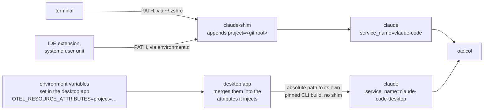

# How desktop app sessions get a project label

Every session started from a terminal or an IDE is tagged with the git
repository it ran in, automatically, by the tagging shim. Sessions started from
the Claude Code desktop app never reach the shim; they get their label a
different way, and only when you set it. This page is why, and how the two
paths meet.

## The mechanism the app bypasses

The label normally comes from `telemetry/shell/claude-shim`, which reads the
git root of the working directory and appends `project=<repo>` to
`OTEL_RESOURCE_ATTRIBUTES` before handing off to the real binary. Getting it to
run means putting it on `PATH` ahead of Claude Code — see
[Telemetry configuration](../reference/telemetry-configuration.md#the-tagging-shim)
for the three places `make enable-telemetry` installs it.

The desktop app never resolves `claude` through `PATH`. It `exec`s a build it
downloads and version-pins itself — under
`~/Library/Application Support/Claude/claude-code/<version>/` on macOS,
`~/.config/Claude/claude-code/<version>/` on Linux — so no `PATH` entry is
consulted. It also injects its own `OTEL_SERVICE_NAME` and
`OTEL_RESOURCE_ATTRIBUTES` into that process at spawn, and tells the CLI which
keys it set.

## The mechanism the app provides

The app builds the `OTEL_RESOURCE_ATTRIBUTES` it injects in two steps: its own
identity fields first (`service.name`, `service.version`, `os.*`, `host.arch`),
then every entry of the `OTEL_RESOURCE_ATTRIBUTES` already present in the
session's environment whose key does not collide with those. `project` does not
collide, so a `project=<repo>` set in the app's environment variables for the
session survives into the CLI unchanged — the same key, the same value, that
the shim would have produced. From the collector onward the two launchers are
indistinguishable apart from `service_name`.

That environment is what the app lets you edit per session under **Environment
variables**. The step-by-step is in
[Collect telemetry](../usage/telemetry.md#tag-a-desktop-app-session).

## Why the label can't come from anywhere else

| Approach | Outcome |
|---|---|
| A wrapper on `PATH` (`~/bin/claude` and friends) | The app resolves an absolute path; `PATH` is never read. |
| `env` in a project's `.claude/settings.json` | Dropped by the CLI. The app declares every key it set at spawn as host-owned, and the settings loader refuses to override those, `OTEL_RESOURCE_ATTRIBUTES` included. |
| Deriving it in the collector | Needs a path on the events. No event type carries a working directory, a workspace, or a session id to join a hook against. |
| A wrapper at the path the app `exec`s | Works, but replaces a file the app installs and updates — rejected in [ADR 0011](adrs/0011-leave-desktop-app-sessions-untagged.md), and still rejected. |
| The app's own environment variables for the session | Works, installs nothing — [ADR 0012](adrs/0012-tag-desktop-sessions-through-the-apps-env-vars.md). |

## What you see

A desktop session started with the variable set appears in the **Project**
dropdown and in spend-by-project under its repository, alongside terminal
sessions of the same repository. One started without it is recorded in full —
spend, tokens, latency, tools, permissions, errors and traces — but groups
under `untagged`, so the named slices read "everything that was tagged", not
"everything".

Either way they report `service_name=claude-code-desktop`, which is why every
query matches `service_name=~"claude-code.*"` — see
[The telemetry pipeline](telemetry-pipeline.md#two-launchers-two-service-names).

`make telemetry-status` reports the untagged event count; it is non-zero
whenever a desktop session was started without the variable.

[ADR 0010](adrs/0010-shim-the-desktop-apps-bundled-cli.md), superseded, holds
the tested evidence behind the first four rows of the table.
