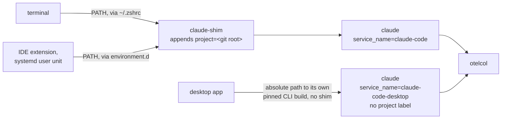

# Why desktop app sessions have no project label

Every session started from a terminal or an IDE is tagged with the git
repository it ran in. Sessions started from the Claude Code desktop app are not:
they group under an empty `project` label. This page is why.

## The mechanism it bypasses

The label comes from `telemetry/shell/claude-shim`, which reads the git root of
the working directory and appends `project=<repo>` to `OTEL_RESOURCE_ATTRIBUTES`
before handing off to the real binary. Getting it to run means putting it on
`PATH` ahead of Claude Code — see
[Telemetry configuration](../reference/telemetry-configuration.md#the-tagging-shim)
for the three places `make enable-telemetry` installs it.

The desktop app never resolves `claude` through `PATH`. It `exec`s a build it
downloads and version-pins itself, at
`~/.config/Claude/claude-code/<version>/claude`, so no `PATH` entry — the
installed `~/.claude/shims/claude`, `~/bin`, or any other — is consulted. It
also injects its own `OTEL_SERVICE_NAME` and `OTEL_RESOURCE_ATTRIBUTES` into
that process at spawn.

## Why the label can't come from somewhere else

| Approach | Why it doesn't work |
|---|---|
| A wrapper on `PATH` (`~/bin/claude` and friends) | The app resolves an absolute path; `PATH` is never read. |
| `env` in a project's `.claude/settings.json` | Applied only when the variable is unset. The app always sets `OTEL_RESOURCE_ATTRIBUTES`, and the inherited value wins. |
| Deriving it in the collector | Needs a path on the events. No event type carries a working directory, a workspace, or a session id to join a hook against. |
| A wrapper at the path the app `exec`s | The only one that works — the app spawns with the session's project as its working directory. It also means replacing a file that app installs and updates, which is why it isn't done: [ADR 0011](adrs/0011-leave-desktop-app-sessions-untagged.md). |

## What you see instead

Desktop sessions are recorded in full — spend, tokens, latency, tools,
permissions, errors and traces are all there. Two things differ:

- **No project attribution.** They are absent from the **Project** dropdown and
  from spend-by-project, so those panels read "among sessions started from a
  terminal or an IDE", not "everything".
- **A different service name.** They report `service_name=claude-code-desktop`,
  which is why every query matches `service_name=~"claude-code.*"` — see
  [The telemetry pipeline](telemetry-pipeline.md#two-launchers-two-service-names).

`make telemetry-status` reports the untagged event count, which is permanently
non-zero on a machine that uses the app.

[ADR 0010](adrs/0010-shim-the-desktop-apps-bundled-cli.md), superseded, holds
the tested evidence behind the table above.
