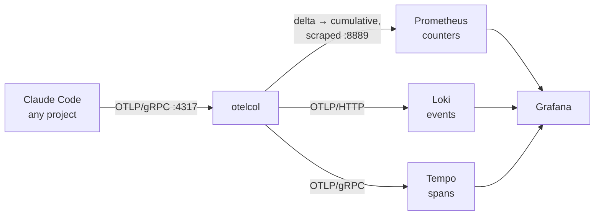

# The telemetry pipeline

How a Claude Code session's telemetry reaches a dashboard, and why the stack has
the shape it does. To turn it on, see
[Collect telemetry from your Claude Code sessions](../usage/telemetry.md); for
the knobs, see [Telemetry configuration](../reference/telemetry-configuration.md).

## Shape

Claude Code speaks OpenTelemetry natively — it needs no plugin, only environment
variables, which is why a single `env` block in `~/.claude/settings.json`
configures every project on the machine at once.

The collector exists because the three signals want three different transports
and Prometheus pulls where Claude Code pushes. It also does the two
transformations the stores need: converting delta counters to cumulative ones,
and promoting resource attributes — notably `project` — to labels that can be
queried.

## Two stores, two kinds of answer

The same session produces both a `claude_code.cost.usage` counter and one
`api_request` event per model call, each carrying `cost_usd`. They do not give
the same answer, and the difference is not small.

Prometheus counters are read with `increase()`, which extrapolates to the edges
of its window. For a steady stream that is accurate enough; for Claude Code it
is not, because sessions are short and sporadic, so almost every window edge
falls inside a gap. Measured against a session that cost exactly `$0.082561`,
`increase()` over the enclosing window reported `$0.108` — a 31% overstatement.

So the split is:

- **Spend, tokens and request counts come from events.** Summing `cost_usd`
  across `api_request` records is exact arithmetic over immutable per-request
  facts, with no rate estimation involved.
- **Sessions, active time, lines of code, commits, pull requests and edit
  decisions come from metrics**, because Claude Code emits no event equivalent
  for them. These are the panels marked `≈`, and the marking is literal.

[ADR 0008](adrs/0008-read-spend-from-events-not-counters.md) records the
decision and what it costs.

Two collector settings follow from the same short-session shape. The Prometheus
exporter expires a series it has not seen for `metric_expiration` — five minutes
by default, which is shorter than the gap between sessions, so series would
vanish and reappear; it is set to 24 hours. And `deltatocumulative` is what lets
a counter survive the process that produced it, since Claude Code exports delta
temporality and the emitting process exits when the session ends.

## Events carry more than metrics

Events are the richer signal in practice. Each `api_request` record carries the
model, cost, duration, all four token counts, the query source, and a `trace_id`
linking it to the span tree in Tempo. Tool calls, permission decisions, MCP
connection failures and API errors exist only as events. This is why the Deep
Dive dashboard is almost entirely Loki.

Only `service_name` and `project` are stream labels; everything else is
structured metadata. That keeps the number of streams tiny — one per project —
while leaving every field filterable.

## Two launchers, two service names

The desktop app spawns its CLI with `OTEL_SERVICE_NAME=claude-code-desktop`,
where every other launcher reports `claude-code`. A query pinned to
`service_name="claude-code"` therefore returns nothing for desktop sessions,
however much they produced — silently, since a stream selector that matches no
stream is not an error. Everything that reads events matches
`service_name=~"claude-code.*"` instead, which keeps the two distinguishable
rather than flattening them into one name.

The same spawn is why the tagging shim never sees those sessions, and why their
`project` label is set in the app instead:
[How desktop app sessions get a project label](telemetry-desktop-sessions.md)
covers that, and what was tried.

## Failure modes worth knowing

**Loki stops accepting writes when its disk fills.** The guard trips at
`LOKI_WAL_DISK_THRESHOLD`, and when it does, metrics keep working while events
silently stop — the worst possible failure, since dashboards still render.
`make enable-telemetry` checks the disk before starting and
`make telemetry-status` reports it afterwards.

That check computes disk use as `used / total`, the way Loki does, rather than
reading `df`'s `Use%` column, which divides by `used + available` and so excludes
the root-reserved blocks. On a large filesystem the two differ by several
points — enough to raise an alarm about a threshold that is not actually close.

**Configuration changes need the right restart.** Files mounted into a container
are not part of the Compose config hash, so editing `otelcol/config.yaml` or
`loki/loki.yaml` needs an explicit `docker compose restart <service>`; `up -d`
alone will report the container as already up to date.

**Running sessions never pick telemetry up.** It is read once at startup. Every
enable and disable path says so, because it is the one part of the flow no
script can fix.

## Why local, and why this stack

The requirement was that no session data leave the machine, which rules out the
hosted backends and leaves a container stack. Reading the local session
transcripts instead — as `ccusage` and similar tools do — stays local too, but
sees only tokens and cost: no tool results, permission decisions, MCP failures,
API errors or latency. [ADR 0007](adrs/0007-local-otel-stack-for-telemetry.md)
records that choice.
