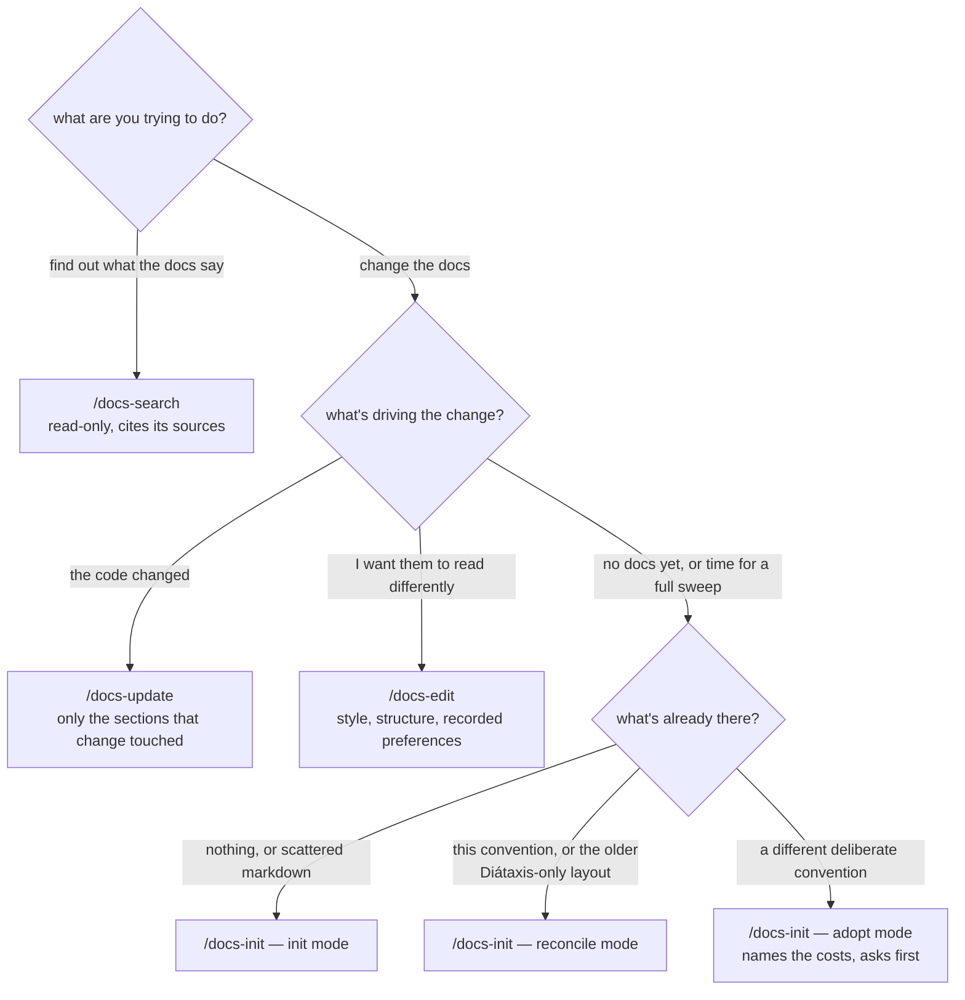

# Document a project with these skills

Once installed, the skills are global — nothing needs to be added to the project you're documenting. Open a Claude Code session in that project and invoke one by name:

```text
/docs-init
/docs-update
/docs-edit
/docs-search
```

All four act on the project you're currently in, never on the docschemy repo itself.

## Choosing between them



The two questions that decide it are **is anything being written** and **what triggered the change** — not how big the job is. `/docs-update` never opens a page the change didn't touch, so it can't find drift elsewhere; it reports what looks stale and leaves it alone. Retrofitting a project to a newer version of the convention is always a `/docs-init` reconcile.

## Asking a question

`/docs-search` answers from the docs and writes nothing, so it's safe to run in the middle of other work:

```text
/docs-search what does the --strict flag actually do?
/docs-search why are we on a queue instead of calling the service directly?
/docs-search what do we have written down about authentication?
```

It cites the page and heading behind each part of the answer, and tells you which of three things happened: the docs answered it, the docs are silent on it, or **the docs contradict the code**. That last one is worth running it for on its own — it's the cheapest way to catch a page that has quietly gone wrong. Whatever it finds, it hands off rather than fixing.

It's the one skill that doesn't need the convention: an older layout, someone else's structure, or a bare `README.md` all still get searched.

## Improving the docs by hand

`/docs-edit` is for changes a person wants, with no code change behind them:

```text
/docs-edit the install page is too long — cut it down and lead with the diagram
/docs-edit split the deployment page; the troubleshooting half should stand alone
/docs-edit rewrite these in British spelling
```

It applies style choices as asked, keeps structural changes inside the convention (naming, routing, repointing every link), and checks any factual claim in your request against the code before writing it — so a request like *"add a note that it retries three times"* either gets verified, or comes back with what the code actually does.

### Recording a preference

Say **"always"**, **"from now on"** or **"I prefer"** and the preference gets written down rather than applied once:

```markdown
## Docs preferences

- Use British spelling.
- Keep usage pages under 150 lines; split rather than scroll.
- Lead every internals page with its diagram, before the prose.
```

That block goes in the project's `CLAUDE.md` — or `~/.claude/CLAUDE.md` if you want it in every project — and all four skills read it. This is what makes a preference stick: without it, the next `/docs-update` has no way to tell your deliberate deviation from drift, and quietly reverts it.

`/docs-edit` will also apply one rule across every existing page in a single sweep, which is how "make it all consistent with this" gets done without a full reconcile.

## Scoping a `/docs-update` run

`/docs-update` works out what changed from whatever is available, in this order:

1. The current conversation, if the change was just made in it.
2. Uncommitted changes (`git diff` / `git status`).
3. A commit range or PR you name — `/docs-update` followed by e.g. `since v1.2.0`.

If none of those are conclusive it asks. Naming the scope explicitly is worth it when the working tree holds more than one change.

## What each run produces

The three write-skills finish with a summary of what they touched, what they deliberately skipped, and anything they marked `<!-- TODO: verify -->` because the repo didn't answer it. Read that last part — it's the list of places the skill refused to guess. `/docs-edit` adds two of its own: the claims it wouldn't write because the code disagreed, and the ones it wrote on your authority alone.

See [Skill catalog](../reference/skill-catalog.md) for each skill's modes and outcomes, and [the documentation convention](../internals/documentation-convention.md) for the structure they produce.
