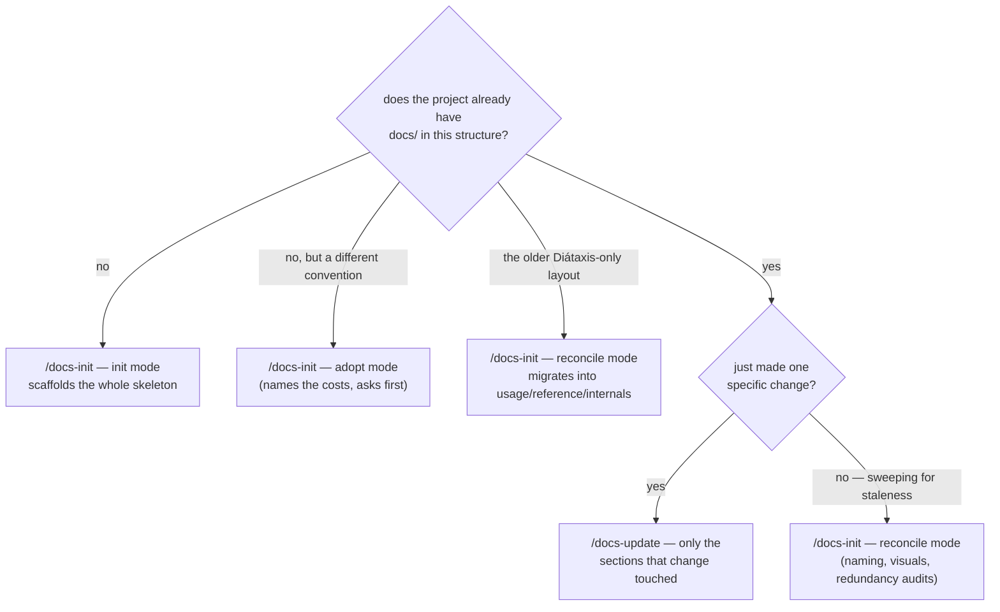

# Document a project with these skills

Once installed, the skills are global — nothing needs to be added to the project you're documenting. Open a Claude Code session in that project and invoke one by name:

```text
/docs-init
/docs-update
```

Both act on the project you're currently in, never on the docschemy repo itself.

## Choosing between them



`/docs-update` never opens a page the change didn't touch, so it can't find drift elsewhere — it reports what looks stale and leaves it alone. Retrofitting a project to a newer version of the convention is always a `/docs-init` reconcile.

## Scoping a `/docs-update` run

`/docs-update` works out what changed from whatever is available, in this order:

1. The current conversation, if the change was just made in it.
2. Uncommitted changes (`git diff` / `git status`).
3. A commit range or PR you name — `/docs-update` followed by e.g. `since v1.2.0`.

If none of those are conclusive it asks. Naming the scope explicitly is worth it when the working tree holds more than one change.

## What each run produces

Both skills finish with a summary of what they touched, what they deliberately skipped, and anything they marked `<!-- TODO: verify -->` because the repo didn't answer it. Read that last part — it's the list of places the skill refused to guess.

See [Skill catalog](../reference/skill-catalog.md) for each skill's modes, and [the documentation convention](../internals/documentation-convention.md) for the structure they produce.
