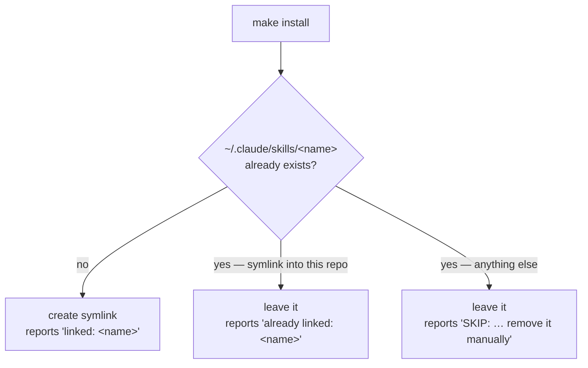

# Install the skills

Clone the repo somewhere permanent, then link the skills into Claude Code:

```sh
git clone <this-repo> ~/devel/docschemy
cd ~/devel/docschemy
make install
```

`make install` symlinks every directory under `skills/` into `~/.claude/skills/`. The clone location matters: the symlinks point back at it, so moving or deleting the checkout breaks every installed skill. Re-run `make install` after moving it.

Restart or reload Claude Code afterwards so it indexes the new skills.

## What happens per skill

`make install` decides one of three outcomes for each skill, and never overwrites a path it didn't create:



The target directory is created with `mkdir -p` if it doesn't exist yet.

## Troubleshooting

**`SKIP: … already exists and is not linked to this repo`** — something else already owns that name: a hand-installed skill, or one from another source. Nothing is overwritten. Delete or rename the conflicting path yourself, then re-run `make install`.

**A skill doesn't show up in Claude Code** — reload the session. Claude Code indexes skills at startup, so a newly linked skill isn't visible to a session that was already running.

**Installing somewhere other than `~/.claude/skills`** — override the path on the command line; see [Makefile targets](../reference/make-targets.md) for the variables.
