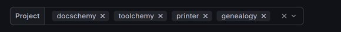
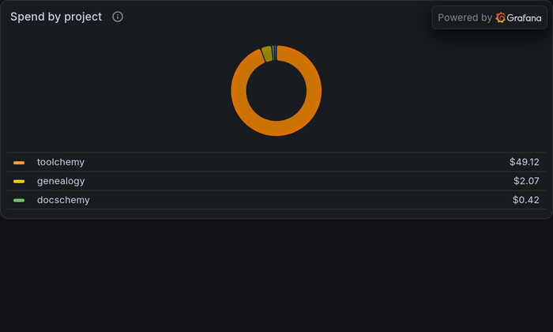

# Read the telemetry dashboards

A panel-by-panel tour of what `make enable-telemetry` puts on
<http://localhost:3000>. Set the stack up first — see
[Collect telemetry from your Claude Code sessions](telemetry.md).

Every figure below is a real capture, filtered to four projects over 30 days.
Yours will show your own repositories.

## The two dashboards

Both live in Grafana's **Claude Code** folder. They answer different questions,
and which one you want depends on whether you are asking about money or about
behaviour.

| Dashboard | Answers | Read when |
|---|---|---|
| Overview | What did I spend, on which model, on which project, and what came back for it | Monthly, or when a bill surprises you |
| Deep Dive | Which requests were slow, which tools failed, which permissions you granted | After a session that felt wrong |

## Overview: where the money went

The five figures across the top are summed from per-request events, so they are
exact rather than estimated.

**Cache read share** is the one to watch. At 98.3% almost every token billed
was a cached read, which is roughly a tenth the price of a fresh input token —
a low share here is usually the reason a bill looks wrong.

**Spend per request** divides the total by the request count. It moves when you
change model or when sessions get longer, and it is a steadier signal than
total spend, which mostly tracks how much you happened to work that month.

The two panels below split the same total two ways: **by model** over time, and
**by project**. Spend concentrates hard — one repository and one model normally
account for most of a month.

### Filtering to a project

The **Project** control at the top left filters every panel on the dashboard at
once. It is populated from the sessions that actually reported, so a repository
appears in the list only once you have used Claude Code in it — and only within
the dashboard's current time range. An empty dropdown almost always means the
range is shorter than the gap since you last worked.

Sessions that reach the collector untagged group under an empty label rather
than disappearing. [Per-project breakdowns](telemetry.md#per-project-breakdowns)
covers how the tagging works and what to do about the untagged ones.

## Overview: what came out of it

Everything in this section is marked `≈` because it comes from Prometheus
counters rather than events, and PromQL reconstructs totals from rate samples.
Treat the numbers as trends, not as an audit trail —
[the pipeline page](../internals/telemetry-pipeline.md#two-stores-two-kinds-of-answer)
explains why the two halves of the dashboard disagree by design.

**Sessions started, by type** is worth a glance. It splits into `fresh`,
`resume` and `continue`; a wall of the latter two against very few `fresh` ones
means long-running context, which shows up on the other dashboard as growing
cache-creation cost.

## Deep Dive: the expensive requests

Sorted by cost, newest range first. The columns that explain a number are
`cache_read_tokens` against `cache_creation_tokens`: a request that created a
large cache rather than reading one is paying to warm it up, which is why the
first request of a session so often tops this table.

`query_source` distinguishes what you asked for from what Claude Code did on
its own — `repl_main_thread` is your conversation, while `prompt_suggestion`,
`generate_session_title` and `away_summary` are background work you never
typed.

## Deep Dive: tools and permissions

**Tool calls by name** against **duration p95** is the pair that finds waste. A
tool that is both frequent and slow — `Bash` here, at 425 calls and a p95 of
4.4 minutes — is where session time actually goes.

**Permission decisions** splits by how each was decided. A high
`accept via user_temporary` count means you are answering prompts by hand that
a settings rule could answer for you; `reject` counts tell you where the model
keeps trying something you do not want.

The **Failures** and **Prompts and traces** sections further down are empty
until something goes wrong, which is the point — a populated `API errors and
refusals` panel or a red `MCP server connections` line is a signal on its own.

## Related

- [Collect telemetry from your Claude Code sessions](telemetry.md) — turning it on, tagging projects, turning it off
- [Telemetry configuration](../reference/telemetry-configuration.md) — every port, settings key and dashboard UID
- [The telemetry pipeline](../internals/telemetry-pipeline.md) — why events and metrics are stored separately
