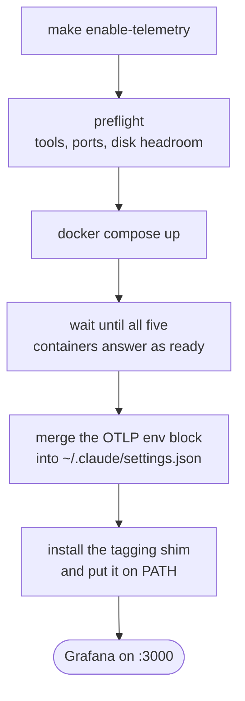

# Collect telemetry from your Claude Code sessions

`make enable-telemetry` brings up a local observability stack and points every
Claude Code session on the machine at it — across all your projects, not just
this one. Nothing leaves the machine: the collector, the three stores and the
dashboards all run in Docker on `127.0.0.1`.

## Before you start

- Docker with the Compose plugin, plus `jq` and `curl`.
- Roughly 1 GB of free disk to start with, and headroom afterwards — Loki stops
  accepting events when its disk crosses a threshold. The command checks this
  and warns you.
- Ports `4317`, `4318`, `3000` and `9090` free, or changed in `telemetry/.env`.

## Turn it on

```sh
make enable-telemetry
```

The command is idempotent — re-running it re-checks everything and reports what
was already in place.



Both files it edits are backed up first, with a timestamp in the name.

**Sessions already running keep sending nothing.** Claude Code reads its
telemetry configuration once at startup, so restart any open session before
expecting data. New sessions are collected automatically.

## Look at the data

Open <http://localhost:3000> — no login — and pick the **Claude Code** folder.
It holds two dashboards: **Overview** for spend, and **Deep Dive** for latency,
tools and failures.

[Read the telemetry dashboards](telemetry-dashboards.md) walks through every
panel on both, with screenshots.

## Per-project breakdowns

Nothing to configure per project. `make enable-telemetry` installs a small
`claude` shim ahead of the real binary on `PATH`; it reads the git repository
name of wherever you started and tags the session with it. That is what fills
the **Project** dropdown and the spend-by-project panel.

It is installed on `PATH` twice, because terminals and everything else get
their environment from different places:

- **Terminals** — via `~/.zshrc`. Run `exec zsh` once to pick it up.
- **The desktop app, IDE extensions, scheduled jobs** — via
  `~/.config/environment.d/`, which is read at login. Log out and back in once.

Until you do both, the launches you have not covered still record everything
else; they just group under an empty project label. `make telemetry-status`
reports how many events in the last 24 hours arrived untagged.

To override the name for one session — a worktree that should report as its
parent repo, say — set it yourself and the shim leaves it alone:

```sh
OTEL_RESOURCE_ATTRIBUTES=project=my-repo claude
```

## Check it is working

```sh
make telemetry-status
```

This goes past "are the containers up" — it reports whether the collector has
received anything, how many events were stored in the last 24 hours, what they
cost, and whether the disk is close to the threshold at which events start
being dropped.

## Turn it off

```sh
make disable-telemetry   # stops the stack, keeps the data
make purge-telemetry     # stops the stack, deletes the data
```

Both remove the settings block, the tagging shim and the `PATH` entries the
installer added, leaving any OTel settings you added yourself alone. After
`make disable-telemetry`, running `make enable-telemetry` again picks up where
you left off.

## Related

- [Telemetry configuration](../reference/telemetry-configuration.md) — every knob, port and settings key
- [The telemetry pipeline](../internals/telemetry-pipeline.md) — how the pieces fit and why
