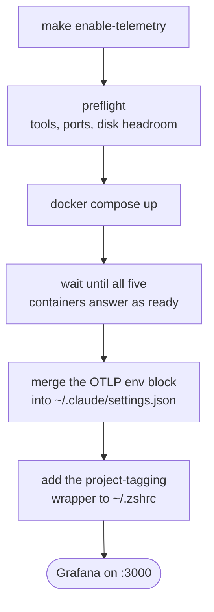

# Collect telemetry from your Claude Code sessions

`make enable-telemetry` brings up a local observability stack and points every
Claude Code session on the machine at it — across all your projects, not just
this one. Nothing leaves the machine: the collector, the three stores and the
dashboards all run in Docker on `127.0.0.1`.

## Before you start

- Docker with the Compose plugin, plus `jq` and `curl`.
- Roughly 1 GB of free disk to start with, and headroom afterwards — Loki stops
  accepting events when its disk crosses a threshold. The command checks this
  and warns you.
- Ports `4317`, `4318`, `3000` and `9090` free, or changed in `telemetry/.env`.

## Turn it on

```sh
make enable-telemetry
```

The command is idempotent — re-running it re-checks everything and reports what
was already in place.



Both files it edits are backed up first, with a timestamp in the name.

**Sessions already running keep sending nothing.** Claude Code reads its
telemetry configuration once at startup, so restart any open session before
expecting data. New sessions are collected automatically.

## Look at the data

Open <http://localhost:3000> — no login — and pick the **Claude Code** folder.

| Dashboard | Answers |
|---|---|
| Overview | What did I spend, on which model, on which project, and what came back for it |
| Deep Dive | Which requests were slow, which tools failed, which permission prompts you answered, and the traces behind them |

Spend and token figures on Overview are summed from per-request events and are
exact. Session, commit and line counts come from metrics and are marked `≈` —
[the pipeline page](../internals/telemetry-pipeline.md#two-stores-two-kinds-of-answer)
explains why the two differ.

## Per-project breakdowns

The shell wrapper added to `~/.zshrc` tags each session with the name of the git
repository it starts in, which is what fills the **Project** dropdown and the
spend-by-project panel. Run `exec zsh` once to load it.

Sessions started without it still record everything else; they group under an
empty project label. To tag one by hand:

```sh
OTEL_RESOURCE_ATTRIBUTES=project=my-repo claude
```

## Check it is working

```sh
make telemetry-status
```

This goes past "are the containers up" — it reports whether the collector has
received anything, how many events were stored in the last 24 hours, what they
cost, and whether the disk is close to the threshold at which events start
being dropped.

## Turn it off

```sh
make disable-telemetry   # stops the stack, keeps the data
make purge-telemetry     # stops the stack, deletes the data
```

Both remove the settings block and the shell wrapper the installer added,
leaving any OTel settings you added yourself alone. After
`make disable-telemetry`, running `make enable-telemetry` again picks up where
you left off.

## Related

- [Telemetry configuration](../reference/telemetry-configuration.md) — every knob, port and settings key
- [The telemetry pipeline](../internals/telemetry-pipeline.md) — how the pieces fit and why
